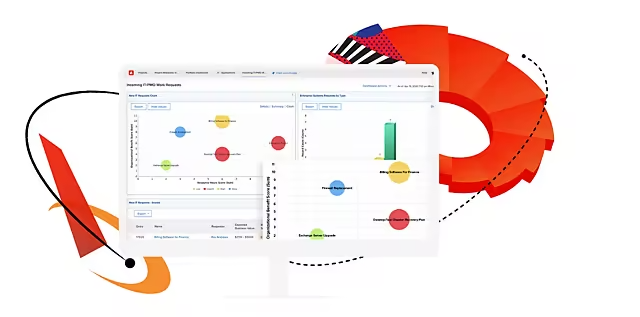

# Integratieconfiguraties voor Adobe Experience Cloud-toepassingen - per oplossing

Deze sectie zal iedereen helpen die een bedrijfsbehoefte heeft maar onzeker is welke producten van de Adobe aan gebruik en hoe te om hen te integreren.  Wij hebben veel van de gemeenschappelijkste integratieconfiguraties voor de Adobe ondernemingsproducten door oplossingscategorieën georganiseerd.  Houd in mening er vele manieren zijn om de producten van de Adobe afhankelijk van uw milieu te vormen.  De bedoeling van deze sectie is richtlijnen te verstrekken die u ongewijzigd kunt opstellen of aanpassen om aan de behoeften van uw milieu te voldoen.

<table>
<tr>
    <td>
      
      
<strong><a href="./b2b.md">B2B-marketing</a></strong>

      

        Automatisering en verkooppartnerschap
      

    </td>
   <td>
      
      
<strong><a href="./commerce.md">[!DNL Commerce]</a></strong>

      

        Digitale handel B2B en B2C
      

   </td>    
   <td>
      
      
<strong><a href="./content-management.md">Contentmanagement</a></strong>

      

        Inhoud- en middelenbeheer
      

   </td>
</tr>
<tr>
   <td>
      
      
<strong><a href="./content-supply-chain.md">Inhoudstoeleveringsketen</a></strong>

      

        Inhoud sneller maken en leveren
      
 
    </td>
   <td>
      
      
<strong><a href="./customer-journeys.md">Klantreizen</a></strong>

      

        Omnichannel orchestratie en levering
      
 
    </td>
   <td>
      
      
<strong><a href="./data-insights.md"> Gegevensinzichten en activering</a></strong>

      

        [!DNL Analytics] en publieksbeheer
      

   </td>  
</tr>
<tr>
   <td>
      
      
<strong><a href="./personalization.md">Personalisatie als schaal</a></strong>

      

        Hoe te om elke verbinding persoonlijk te maken
      

   </td>
</table>
