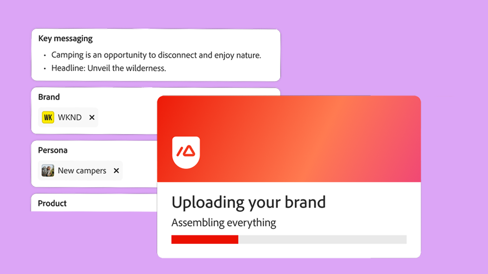
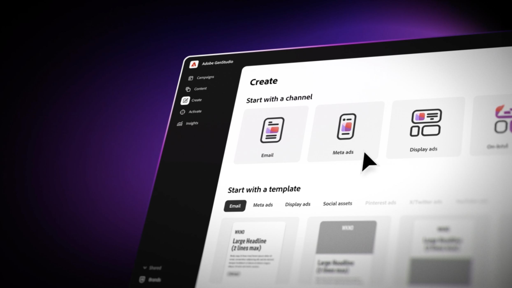

# GenStudio Academy

<table>
 <tr style= "border: 0;">
  <td> <strong style= "font-size: 2em"> verhoog uw generatieve kennis van AI.  </strong>
U leert de generatieve AI-vaardigheden gebruiken om uw creatieve en marketingworkflows te transformeren. 
<a href="https://learningmanager.adobe.com/accountiplogin?ipId=16970&amp;accesskey=c4988oojirhb5" rel="noreferrer" target="_blank" class="spectrum-Button spectrum-Button--fill spectrum-Button--accent spectrum-Button--sizeM"> Register </a>          <a href="https://genstudioacademy.adobelearningmanager.com/" rel="noreferrer" target="_blank" class="spectrum-Button spectrum-Button--fill spectrum-Button--accent spectrum-Button--sizeM"> Login </a></td>
  <td></td>
 </tr>
</table>

<table>
 <tr style= "border: 0;">
  <td align="center">
    <strong style= "font-size: 2em"> Hoofd generatieve AI met de Academie van GenStudio.</strong>
Echte essentiële vaardigheden voor het integreren van generatieve AI in uw creatieve en marketing werkschema-om het even welk tijd, overal, en volledig vrij.
  </td>
 </tr>
</table>

>[!BEGINSHADEBOX]

<table>
 <tr style= "border: 0;">
  <td></td>
  <td align="center"> <strong style= "font-size: 2em"> Generatieve AI voor marketing. Vereenvoudigd.</strong>
 GenStudio Academy transformeert complexe generatieve AI-taken in eenvoudig te volgen cursussen, zoals richtlijnen voor het transformeren van merken. Studenten kunnen via downloadbare hulplijnen en video's de algemene AI beheren, één concept tegelijk.
<a href="https://learningmanager.adobe.com/accountiplogin?ipId=16970&amp;accesskey=c4988oojirhb5" rel="noreferrer" target="_blank" class="spectrum-Button spectrum-Button--fill spectrum-Button--accent spectrum-Button--sizeM">Nu verkennen</a></td>
 </tr>
</table>

>[!ENDSHADEBOX]

<table>
 <tr style= "border: 0;">
  <td align="center"> <strong style= "font-size: 2em"> Niveaus van het leren. Grenzen ontgrendelde kans.</strong>
Met de kennisniveaus van de Academie van GenStudio, is het eenvoudig om inhoud te vinden die uw generatieve AI vaardigheden-of u over LLMs leert, snel verwezenlijking beheerst, of AI hulpmiddelen in actie ziet. GenStudio Academy heeft iets voor iedereen.</td>
  <td></td>
 </tr>
</table>

<table>
 <!-- <tr style= "border: 0;colspan: 3;">
  <td colspan=3> <strong style= "font-size: 2em;">Coming soon to Genstudio Academy</strong></td>
 </tr> --> 
 <tr style= "border: 0;colspan: 3;"> 
   <td>
      
      

      <a href="www.adobe.com"> <strong> Tips en trucs </strong>
      </a>
      

      

      Tips en trucs om GenStudio for Performance Marketing op de meest efficiënte manier te gebruiken.
      

   </td>
   <td>
      
      

      <a href="www.adobe.com"> <strong> Professionele cursussen </strong>
      </a>
      

      

      Geavanceerde cursussen om AI-vaardigheden op het niveau van experts op het gebied van marketing te ontsluiten.
      

   </td>
 </tr>
</table>

>[!BEGINSHADEBOX]

<table>
    <tr></tr>
 <tr style= "border: 0;">
 <td></td>
  <td> <strong style= "font-size: 2em"> zet uw lessen in praktijk </strong>
Ontdek GenStudio for Performance Marketing als een generatieve AI-First-toepassing waarmee marketingteams hun eigen advertenties en e-mails kunnen maken om onhandige, gepersonaliseerde marketingcampagnes te voeren.
<a href="https://learningmanager.adobe.com/accountiplogin?ipId=16970&amp;accesskey=c4988oojirhb5" rel="noreferrer" target="_blank" class="spectrum-Button spectrum-Button--fill spectrum-Button--accent spectrum-Button--sizeM">Neem me mee</a></td>
 </tr>
    <tr></tr>
</table>

>[!ENDSHADEBOX]

<!--
## Heading 2 SHADEBOXES

<table>
 <tr style= "border: 0;">
  <td></td>
  <td align="center"> <strong style= "font-size: 2em">Image left / Text right</strong>
 Bacon ipsum dolor amet tri-tip buffalo kevin landjaeger beef ribs pork loin, brisket doner sirloin. Buffalo pig sausage, leberkas sirloin ham meatball t-bone tenderloin. Jerky kevin landjaeger prosciutto, cupim capicola boudin. 
<a href="https://business.adobe.com/products/genstudio.htmlL" rel="noreferrer" target="_blank" class="spectrum-Button spectrum-Button--fill spectrum-Button--accent spectrum-Button--sizeM">Explore Now</a></td>
 </tr>
</table>

<table>
 <tr style= "border: 0;colspan: 2;">
  <td> <strong style= "font-size: 2em">Coming soon to Genstudio Academy</strong></td>
 </tr> 
 <tr> 
    <td align="left"></td>
    <td align="center"></td>
    <td align="right"></td>
 </tr>
</table>

>[!BEGINSHADEBOX]

<table>
 <tr style= "border: 0;">
  <td> <strong style= "font-size: 2em">Adobe GenStudio Academy</strong>
 Become a Generative AI leader. Master the AI skills to transform your workflows and lead your industry forward. 
<a href="https://business.adobe.com/products/genstudio.htmlL" rel="noreferrer" target="_blank" class="spectrum-Button spectrum-Button--fill spectrum-Button--accent spectrum-Button--sizeM">Register</a>&nbsp&nbsp&nbsp&nbsp&nbsp&nbsp&nbsp   <a href="https://business.adobe.com/products/genstudio.htmlL" rel="noreferrer" target="_blank" class="spectrum-Button spectrum-Button--fill spectrum-Button--accent spectrum-Button--sizeM">Login</a></td>
  <td></td>
 </tr>
</table>

>[!ENDSHADEBOX]

### Coming soon to Genstudio Academy

<table>
 <tr> 
    <td align="left"></td>
    <td align="center"></td>
    <td align="right"></td>
 </tr>
</table>

-->